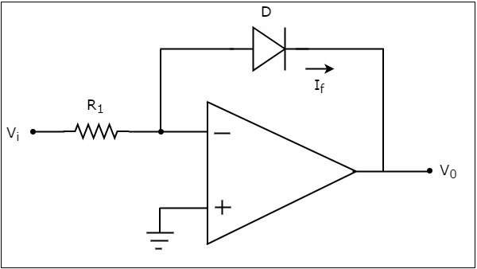
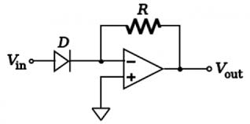

### Introduction
 
The electronic circuits which perform the mathematical operations such as logarithm and anti-logarithm (exponential) with an amplification are called as Logarithmic amplifier and Anti-Logarithmic amplifier respectively. 

### 1)Log Amplifier

A logarithmic amplifier (or a log amplifier) is an electronic circuit that produces an output that is proportional to the logarithm of the applied input. Other applications for log/anti-log amplifiers include signal compression and process control. Signals are often compressed in order to decrease their dynamic range (i.e., the difference between the highest and lowest level signals). In telecommunications systems, this may be required in order to achieve reasonable
voice or data transmission with limited resources. An op-amp based logarithmic amplifier produces a voltage at the output, which is proportional to the logarithm of the voltage applied to the resistor connected to its inverting terminal.         

<b>𝐼𝐸 = (𝑒(qVE/𝑘𝑇) − 1)  </b>

Since IC = IE for a grounded base transistor, 

<b>𝐼C = Is(𝑒(qVE/𝑘𝑇) − 1),</b> 

Where   
IS = emitter saturation current ≈ 10-13 A 
k = Boltzmann’s Constant  
T = absolute temperature (in K) 
Therefore, 𝑒(qVE/𝑘𝑇) = (IC/IS)+1 = IC/IS(nearly equal) 
Taking natural log on both sides, we get  

<b>VE=(kT/q)* ln(IC/IS), also VE=-V0</b> 
 

 

<b> Figure 1. Log Amplifier</b>

 

### 2)Antilog Amplifier 

An anti-logarithmic amplifier, or an anti-log amplifier, is an electronic circuit that produces an output that is proportional to the anti-logarithm of the applied input. This section discusses about the op-amp based anti-logarithmic amplifier in detail.
An op-amp based anti-logarithmic amplifier produces a voltage at the output, which is proportional to the anti-logarithm of the voltage that is applied to the diode connected to its inverting terminal. 
The circuit diagram of an op-amp based anti-logarithmic amplifier is shown in the following figure − 

  

<b> Figure 2. Antilog Amplifier </b>
  

<b>VO=-RfIse(Vin/VT)</b>

Note that, in the above equation the parameters n, VT and Is are constants. So, the output voltage V0 will be proportional to the anti-natural logarithm(exponential) of the input voltage Vi, for a fixed value of feedback resistance Rf.
 
### Applications 
Two voltages A and B can be multiplied using log and antilog amplifier. Firstly, log of both the voltages is taken and added. 

<b>log(A) + log(B) = log(AB)</b>
 

Then antilog is taken and the output obtained is AxB. 
Similarly, two voltages can be divided using log and antilog amplifier.

